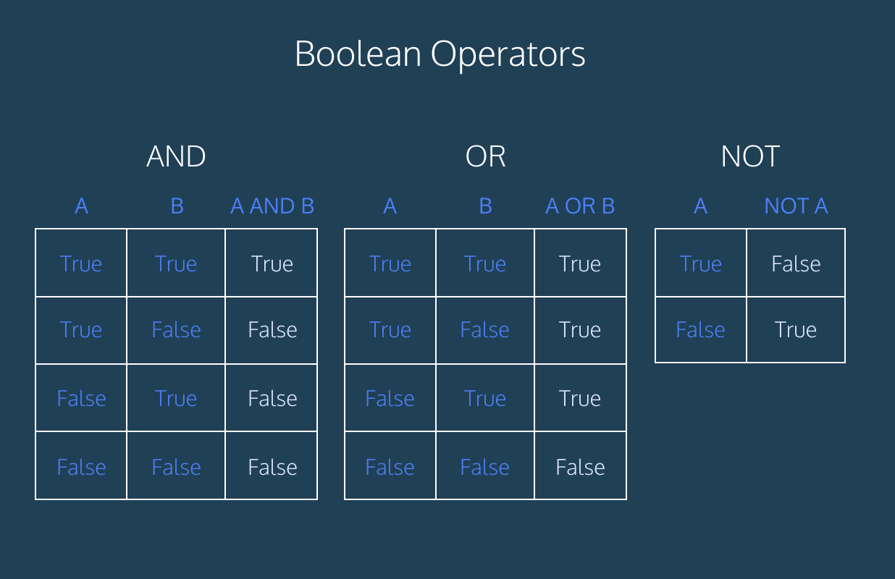

# 404B Lesson 2 Class Exercise - Nested For Loop

## Instructions

### Split VS Code Window

You can drag `main.py` tab to the right side of the window to split the window into two panes. This will allow you to see the instructions and the code at the same time.

### Answering

You can answer the questions by writing your answers in the `main.py` file.

You can run the code by clicking the `Run` button on the top right corner of the editor.

The output will be shown in the `Terminal` tab at the bottom of the editor.

## Relational Operators

| Operator | Meaning | Example | Value |
| ----------- | ----------- | ----------- | ----------- |
| == | Equal to | 2 + 2 == 4 | True
| != | Not equal to | 3.2 != 4 | False
| < | Less than | 4 < 3 | False
| > | Greater than | 4 > 3 | True
| <= | Less than or equal to | 2 <= 0 | False
| >= | Greater than or equal to | 2.4 >= 1.6 | True

## Truth Table



## if/else Examples

### Sample 1

```python
if age < 18:
   print('You are a teenager')
else:
   print('You are an adult')
```

### Sample 2

```python
if age < 13 or age > 65:
   print('Ticket price: $50')

if age >= 13 and age < 65:
   print('Ticket price: $100')
```

## Questions

1. Given the variable declarations:

    ```python
    x = 4
    y = -3
    z = 4
    ```

   What are the results of the following relational expressions?

    | Question | Expressions | Answer |
    | :-- | :-- | :--: |
    | a | x == 4 | **True**
    | b | x == y |
    | c | x == z |
    | d | y == z |
    | e | x + y > 0 |
    | f | x - z != 0 |
    | g | x % 2 == 0 |
    | h | y / y == 1|
    | i | x *(y + 2) > y - (y + z)* 2 |

2. Translate the following statements into logical tests that could be used in an if/else statement

    | Question | Condition | Expression |
    | :-- | :-- | :--: |
    | a | y is positive | **y > 0**
    | b | z is not zero |
    | c | y is greater in value than z |
    | d | z is non-negative |
    | e | x is closer in value to y than z is |
    | f | z is odd |
    | g | x is even |
    | h | y is a multiple of z |
    | i | y is a non-negative one-digit number |
    | j | x and z are of opposite signs |
    | k | either x or y is even, and the other is odd |

3. Examine the code and describe a case in which the code would print something that is untrue about the number that was entered.\
   Then correct the logic error in the code.

   ```python
   number = int(input('Give me a number: '))
   
   if number % 2 == 0:
       if number % 3 == 0:
           print("Divisible by 6.")
       else:
           print("Odd number.")
   ```

## Submitting Your Work

1. Make sure the assignment repository is opened in VS Code.

2. Make sure you have completed all the tasks.

3. (First time only)
Use Command + J to open the Terminal tab and config your git username and email:

    ```bash
    git config user.name "Your Name"
    git config user.email "Your GitHub Email"
    ```

4. Click on the "Source Control" icon on the left. Source Control

    

5. Enter a commit message and click on the "Commit" button.

Click on the "Sync Changes" button.
